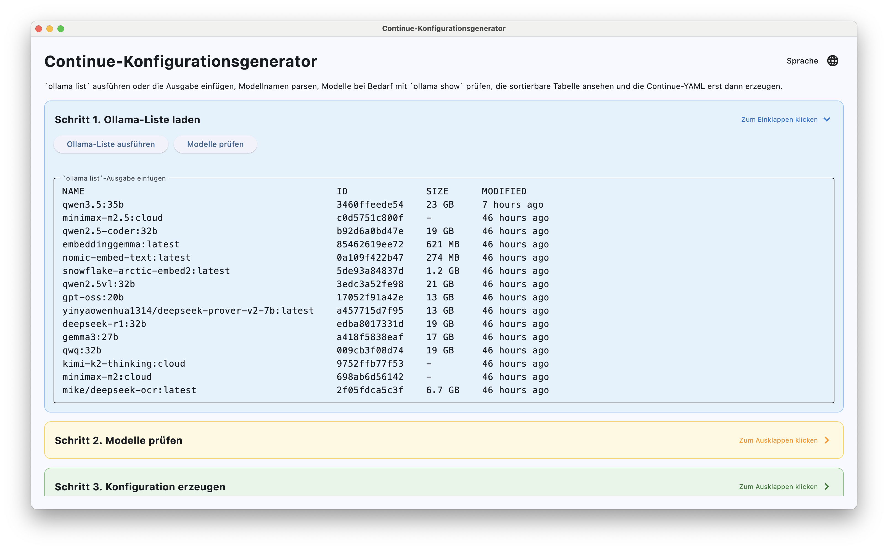
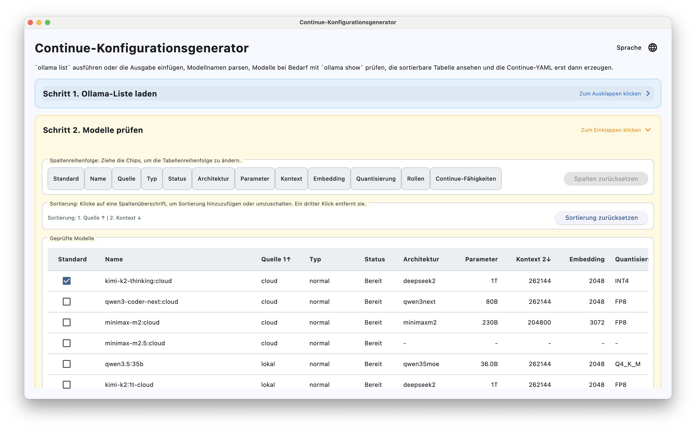
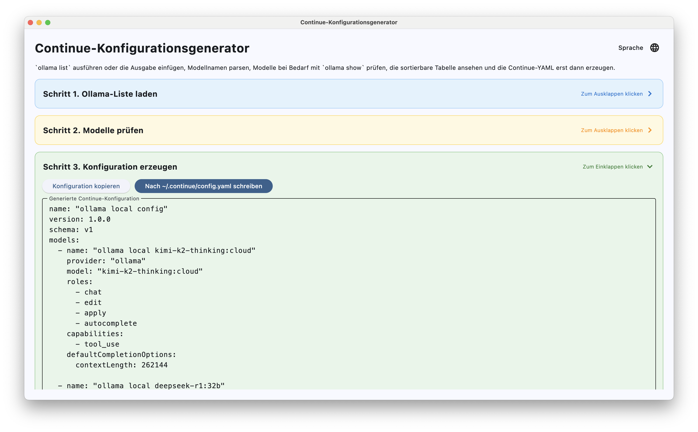

# Continue Config Generator

[中文](README.md) | [English](README.en.md) | [Deutsch](README.de.md)


Ein Desktop-Tool auf Basis von Python und Flet, das die Ausgabe von `ollama list` und `ollama show` einliest und daraus eine direkt nutzbare Continue-`config.yaml` erzeugt.

## Download

- Releases: Lade das passende Paket fuer deine Plattform von der `Releases`-Seite des Repositorys herunter
- CI-Artefakte: Alternativ kannst du die neuesten Build-Artefakte aus GitHub Actions herunterladen

Erwartete Download-Dateien sind:

- `ContinueConfigGenerator-macos-intel.zip`
- `ContinueConfigGenerator-macos-arm.zip`
- `ContinueConfigGenerator-windows-x64.zip`
- `ContinueConfigGenerator-linux-x64.tar.gz`
- `ContinueConfigGenerator-flet-macos-intel.zip`
- `ContinueConfigGenerator-flet-macos-arm.zip`
- `ContinueConfigGenerator-flet-windows-x64.zip`
- `ContinueConfigGenerator-flet-linux-x64.tar.gz`

## Screenshots





## Funktionen

- `ollama list` direkt ausfuehren oder die Ausgabe manuell einfuegen
- Modell-Metadaten gesammelt mit `ollama show` pruefen
- Zwischen normalen Modellen und reinen Embedding-Modellen unterscheiden
- Die Tabelle sortieren und Modellfaehigkeiten sowie Kontextlaenge pruefen
- Ein Standardmodell waehlen und Continue-YAML erzeugen
- Die erzeugte Konfiguration kopieren oder nach `~/.continue/config.yaml` schreiben
- Unterstuetzung fuer Englisch, Deutsch und Chinesisch

## Technischer Stack

- Python 3.14
- [Flet](https://flet.dev/)
- PyInstaller
- Pipenv

## Lokal ausfuehren

Stelle zuerst sicher, dass `ollama` installiert ist und auf dem System verfuegbar ist.

```bash
pip install pipenv
pipenv sync --dev
pipenv run python app.py
```

## Lokal bauen

### Option A: PyInstaller

```bash
pipenv run pyinstaller --noconfirm --clean --windowed --name ContinueConfigGenerator app.py
```

Die Standard-Ausgabe liegt unter:

- macOS: `dist/ContinueConfigGenerator.app`
- Windows: `dist/ContinueConfigGenerator/ContinueConfigGenerator.exe`
- Linux: `dist/ContinueConfigGenerator/`

### Option B: Flet Build

Der eingebaute Flet-Packager verwendet `flet-cli`. Dieses Projekt ist aktuell auf `flet 0.82.2` festgelegt, deshalb sollte die CLI-Version dazu passen.

```bash
pipenv run python -m pip install "flet[cli]==0.82.2"
pipenv run flet build macos app.py
```

Die Zielplattform kann ersetzt werden durch:

- `macos`
- `windows`
- `linux`

Flet Build schreibt die Ausgabe standardmaessig nach `build/<platform>/`, zum Beispiel:

- macOS: `build/macos/`
- Windows: `build/windows/`
- Linux: `build/linux/`

## GitHub Actions

Dieses Repository enthaelt zwei Workflow-Saetze.

PyInstaller-Workflows:

- `.github/workflows/build-macos-intel.yml`
- `.github/workflows/build-macos-arm.yml`
- `.github/workflows/build-windows.yml`
- `.github/workflows/build-linux.yml`

Flet-Build-Workflows:

- `.github/workflows/flet-build-macos-intel.yml`
- `.github/workflows/flet-build-macos-arm.yml`
- `.github/workflows/flet-build-windows.yml`
- `.github/workflows/flet-build-linux.yml`

Ausloeser:

- Manuell ueber `workflow_dispatch`
- Durch Tags mit dem Muster `v*`

Jeder Workflow:

- installiert Python 3.14 und Pipenv
- fuehrt `pipenv sync --dev` aus
- baut die Desktop-App mit PyInstaller oder Flet Build
- packt die Artefakte und laedt sie in GitHub Actions hoch
- haengt bei Tag-Builds Release-Dateien an

## Projektstruktur

```text
.
├── app.py
├── Pipfile
├── Pipfile.lock
├── .github/
│   └── workflows/
└── README.md
```

## Voraussetzungen

- Ollama ist installiert
- `ollama list` und `ollama show <model>` funktionieren auf dem System
- Die Continue-Erweiterung ist installiert und du moechtest deren lokale Konfigurationsdatei erzeugen

## Lizenz

Dieses Projekt steht unter der MIT-Lizenz. Details stehen in [LICENSE](LICENSE).
