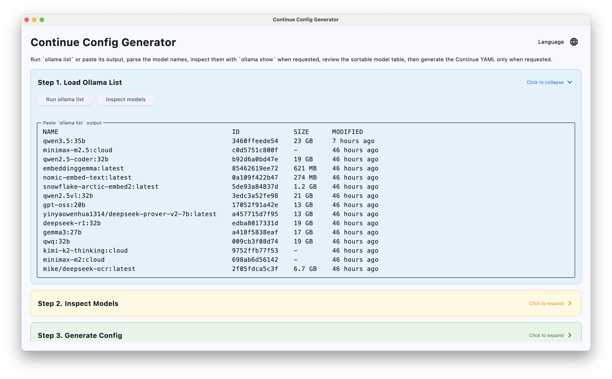
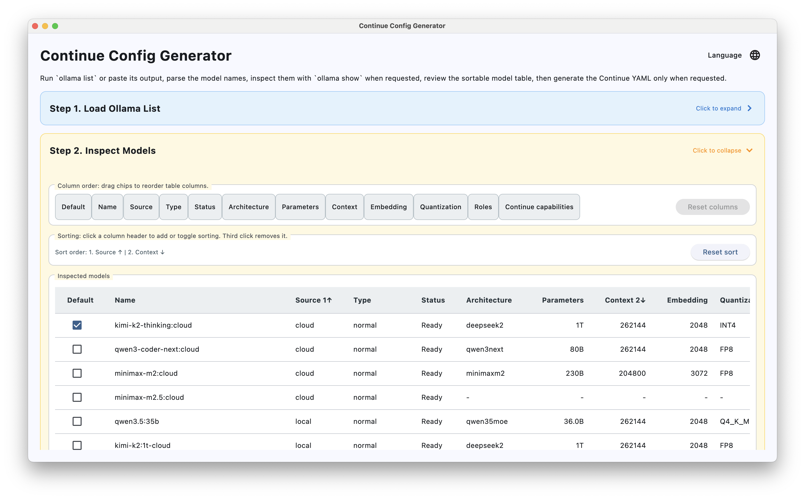
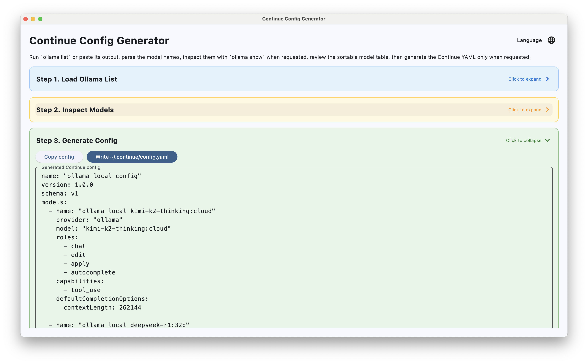

# Continue Config Generator

[中文](README.md) | [English](README.en.md) | [Deutsch](README.de.md)


A desktop tool built with Python and Flet for reading `ollama list` / `ollama show` output and generating a Continue `config.yaml` that can be used directly.

## Download

- Releases: download the package for your platform from the repository's `Releases` page
- CI artifacts: you can also download the latest build from GitHub Actions workflow artifacts

Expected downloadable files include:

- `ContinueConfigGenerator-macos-intel.zip`
- `ContinueConfigGenerator-macos-arm.zip`
- `ContinueConfigGenerator-windows-x64.zip`
- `ContinueConfigGenerator-linux-x64.tar.gz`
- `ContinueConfigGenerator-flet-macos-intel.zip`
- `ContinueConfigGenerator-flet-macos-arm.zip`
- `ContinueConfigGenerator-flet-windows-x64.zip`
- `ContinueConfigGenerator-flet-linux-x64.tar.gz`

## Screenshots





## Features

- Run `ollama list` directly or paste its output manually
- Inspect model metadata in batches via `ollama show`
- Distinguish normal models from embedding-only models
- Sort the table and review model capabilities and context length
- Choose a default model and generate Continue YAML
- Copy the generated config or write it to `~/.continue/config.yaml`
- English, German, and Chinese UI support

## Tech Stack

- Python 3.14
- [Flet](https://flet.dev/)
- PyInstaller
- Pipenv

## Run Locally

Make sure `ollama` is installed and available on your machine first.

```bash
pip install pipenv
pipenv sync --dev
pipenv run python app.py
```

## Build Locally

### Option A: PyInstaller

```bash
pipenv run pyinstaller --noconfirm --clean --windowed --name ContinueConfigGenerator app.py
```

The default build output is located at:

- macOS: `dist/ContinueConfigGenerator.app`
- Windows: `dist/ContinueConfigGenerator/ContinueConfigGenerator.exe`
- Linux: `dist/ContinueConfigGenerator/`

### Option B: Flet Build

Flet's built-in packaging command depends on `flet-cli`. This project is currently pinned to `flet 0.82.2`, so the CLI version should match.

```bash
pipenv run python -m pip install "flet[cli]==0.82.2"
pipenv run flet build macos app.py
```

You can replace the target platform with:

- `macos`
- `windows`
- `linux`

Flet Build writes output to `build/<platform>/` by default, for example:

- macOS: `build/macos/`
- Windows: `build/windows/`
- Linux: `build/linux/`

## GitHub Actions

This repository includes two workflow sets.

PyInstaller workflows:

- `.github/workflows/build-macos-intel.yml`
- `.github/workflows/build-macos-arm.yml`
- `.github/workflows/build-windows.yml`
- `.github/workflows/build-linux.yml`

Flet Build workflows:

- `.github/workflows/flet-build-macos-intel.yml`
- `.github/workflows/flet-build-macos-arm.yml`
- `.github/workflows/flet-build-windows.yml`
- `.github/workflows/flet-build-linux.yml`

Trigger methods:

- Manual `workflow_dispatch`
- Pushing tags matching `v*`

Each workflow will:

- Install Python 3.14 and Pipenv
- Run `pipenv sync --dev`
- Build the desktop app with PyInstaller or Flet Build
- Package and upload artifacts to GitHub Actions
- Attach release assets when building from a tag

## Project Structure

```text
.
├── app.py
├── Pipfile
├── Pipfile.lock
├── .github/
│   └── workflows/
└── README.md
```

## Requirements

- Ollama is installed
- `ollama list` and `ollama show <model>` run correctly on the machine
- The Continue extension is installed and you want to generate its local config file

## License

This project is licensed under the MIT License. See [LICENSE](LICENSE) for details.
