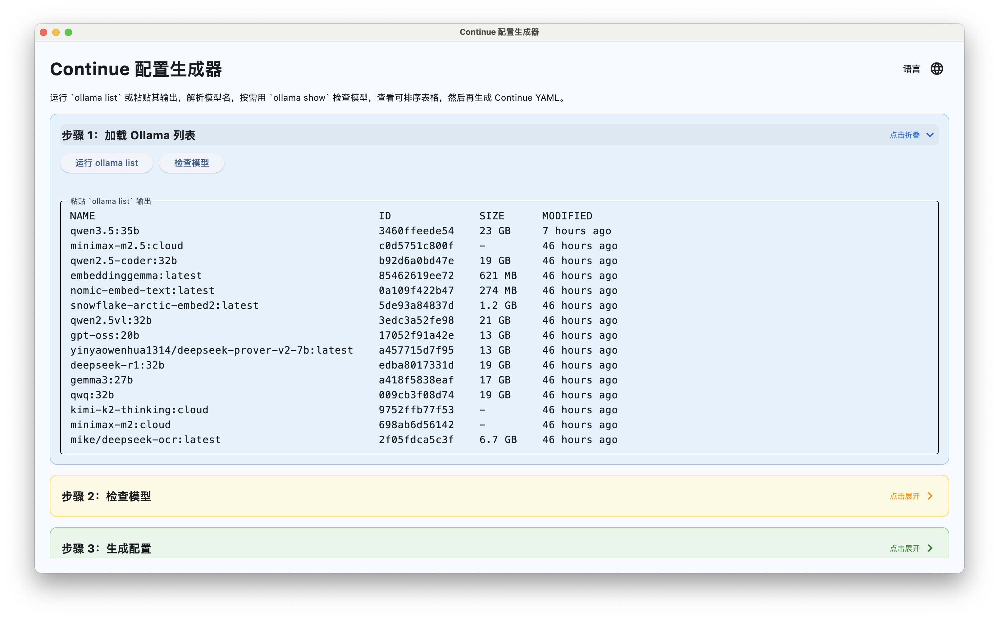
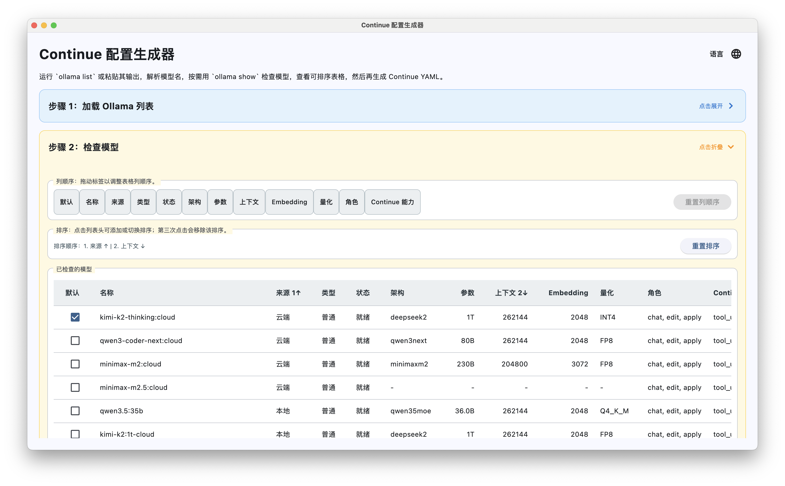
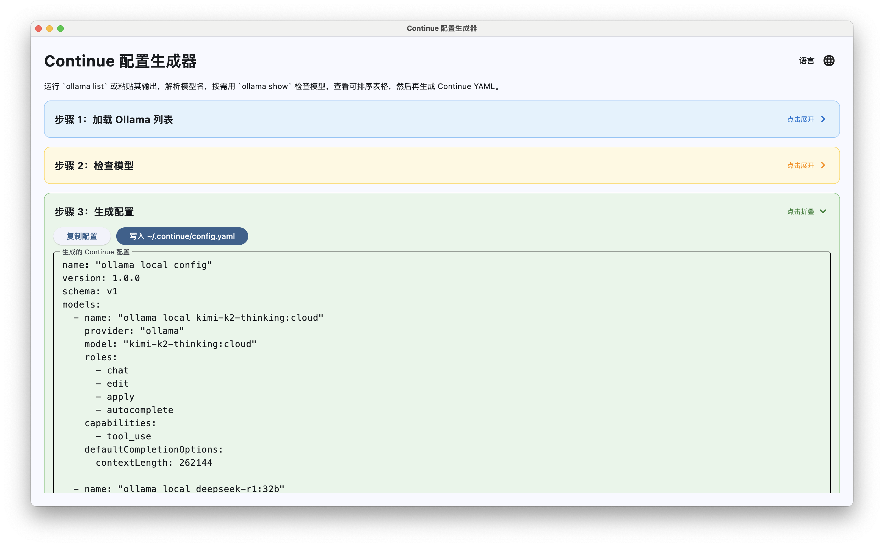

# Continue Config Generator

[中文](README.md) | [English](README.en.md) | [Deutsch](README.de.md)


一个基于 Python + Flet 的桌面工具，用来通过 Ollama REST API 读取本机、局域网或其他服务器上的模型信息，并生成可直接写入 Continue 的 `config.yaml`。

## 下载

- 发布版本：前往仓库的 `Releases` 页面下载对应平台的构建产物
- 持续集成产物：也可以在 GitHub Actions 的 workflow artifact 中下载最新构建包

预期可下载文件包括：

- `ContinueConfigGenerator-macos-intel.zip`
- `ContinueConfigGenerator-macos-arm.zip`
- `ContinueConfigGenerator-windows-x64.zip`
- `ContinueConfigGenerator-linux-x64.tar.gz`
- `ContinueConfigGenerator-flet-macos-intel.zip`
- `ContinueConfigGenerator-flet-macos-arm.zip`
- `ContinueConfigGenerator-flet-windows-x64.zip`
- `ContinueConfigGenerator-flet-linux-x64.tar.gz`

macOS 打包版会先使用 `PATH`，找不到 `ollama` 时再自动尝试常见安装位置，例如 Apple Silicon 机器上的 `/opt/homebrew/bin/ollama`。

## 截图





## 功能

- 输入 Ollama 服务地址，例如 `http://localhost:11434` 或 `http://192.168.1.50:11434`
- 通过 `/api/tags` 获取模型列表，也可手动粘贴模型列表
- 批量调用 `/api/show` 检查模型元数据
- 区分普通模型与 embedding-only 模型
- 在表格中排序、查看模型能力与上下文长度
- 选择默认模型并生成 Continue YAML
- 一键复制配置，或写入 `~/.continue/config.yaml`
- 支持英文、德文、中文界面

## 技术栈

- Python 3.14
- [Flet](https://flet.dev/)
- PyInstaller
- Pipenv

## 本地运行

先确保目标 Ollama 服务可通过 HTTP 访问。若要访问局域网服务器，Ollama 服务端需要监听对应网络地址，并且防火墙允许访问端口，默认端口是 `11434`。

```bash
pip install pipenv
pipenv sync --dev
pipenv run python app.py
```

## 本地打包

### 方案 A: PyInstaller

```bash
pipenv run pyinstaller --noconfirm --clean --windowed --name ContinueConfigGenerator app.py
```

打包结果默认位于：

- macOS: `dist/ContinueConfigGenerator.app`
- Windows: `dist/ContinueConfigGenerator/ContinueConfigGenerator.exe`
- Linux: `dist/ContinueConfigGenerator/`

### 方案 B: Flet Build

Flet 自带的打包命令依赖 `flet-cli`。本项目当前锁定的是 `flet 0.82.2`，对应 CLI 版本也应保持一致。

```bash
pipenv run python -m pip install "flet[cli]==0.82.2"
pipenv run flet build macos app.py
```

可替换目标平台：

- `macos`
- `windows`
- `linux`

Flet Build 默认输出在 `build/<platform>/`，例如：

- macOS: `build/macos/`
- Windows: `build/windows/`
- Linux: `build/linux/`

## GitHub Actions

仓库包含两套独立 workflow。

PyInstaller 版本：

- `.github/workflows/build-macos-intel.yml`
- `.github/workflows/build-macos-arm.yml`
- `.github/workflows/build-windows.yml`
- `.github/workflows/build-linux.yml`

Flet Build 版本：

- `.github/workflows/flet-build-macos-intel.yml`
- `.github/workflows/flet-build-macos-arm.yml`
- `.github/workflows/flet-build-windows.yml`
- `.github/workflows/flet-build-linux.yml`

触发方式：

- 手动触发 `workflow_dispatch`
- 推送标签 `v*`

每个 workflow 都会：

- 安装 Python 3.14 与 Pipenv
- 执行 `pipenv sync --dev`
- 使用 PyInstaller 或 Flet Build 构建 GUI 应用
- 产出压缩包并上传为 GitHub Actions artifact
- 在标签构建时附加到 GitHub Release

## 目录结构

```text
.
├── app.py
├── Pipfile
├── Pipfile.lock
├── .github/
│   └── workflows/
└── README.md
```

## 使用前提

- 已安装 Ollama，或者有可访问的远程 Ollama 服务
- 目标服务能正常响应 `/api/tags` 与 `/api/show`
- 已安装 Continue 扩展，并希望生成其本地配置文件

## 许可证

本项目使用 MIT License，详见 [LICENSE](LICENSE)。
